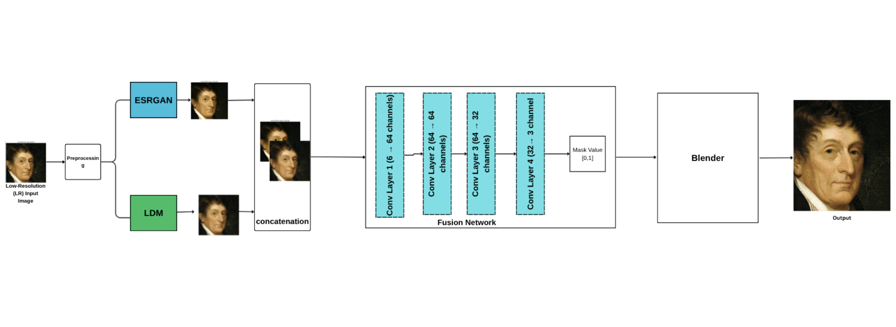
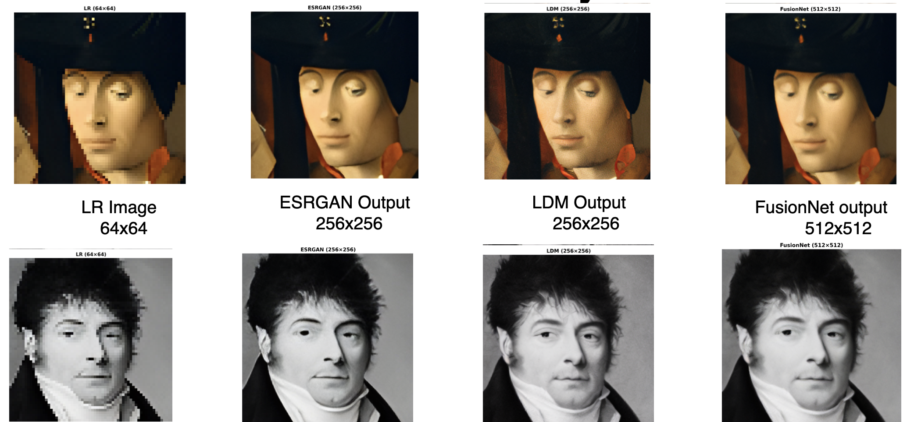

# Feature-Level Fusion of GAN and Diffusion Models for Image Enhancement

A deep learning framework that combines the strengths of ESRGAN and Latent Diffusion Models (LDM) using a feature-level fusion network for image super-resolution and image enhancement.

The proposed approach extracts complementary features from both models and blends them through a trainable fusion network to generate high-quality images with improved structural consistency and perceptual quality.

---

## Features

- Image Super Resolution
- Feature-Level Fusion
- ESRGAN + Latent Diffusion Model
- Adaptive Blending
- Fusion Network
- Higher PSNR than individual models
- PyTorch Implementation

---

## Project Architecture

<p align="center">
  
</p>

---
## Dataset

This project uses the **MetFaces Dataset**, a collection of high-quality face images extracted from works of art. The dataset contains **1,336** aligned face images and is suitable for image super-resolution and image enhancement tasks. :contentReference[oaicite:1]{index=1}

🔗 **Download Dataset:** https://www.kaggle.com/datasets/thedevastator/metfaces-image-dataset

## Pipeline

Low Resolution Image

↓

Preprocessing

↓

ESRGAN + LDM

↓

Feature Concatenation

↓

Fusion Network

↓

Adaptive Blender

↓

Enhanced High Resolution Image

---

## Results

| Model | PSNR |
|-------|------|
| ESRGAN | 25.3594 |
| LDM | 26.5598 |
| Proposed Fusion Model | **27.7862** |

The proposed fusion model achieves better reconstruction quality than both ESRGAN and LDM individually.

---

## Sample Output

<p align="center">
  
</p>

---

## Dataset

MetFace Dataset

- Total Images: 1336
- Resolution: 512 × 512

---

## Tech Stack

- Python
- PyTorch
- ESRGAN
- Latent Diffusion Model
- OpenCV
- NumPy
- Google Colab

---

## Repository Structure

```
image-enhancement-with-LDM-and-ESRGAN
│
├── Code/
├── Paper/
│   └── Feature-Level_Fusion.pdf
├── images/
│   ├── architecture.png
│   ├── result.png
│   └── dataset.png
├── README.md
└── requirements.txt
```

---

## Research Paper

You can read the complete research paper here.

📄 [Feature-Level Fusion of GAN and Diffusion Models for Image Enhancement](Paper/Feature-Level Fusion of GAN and Diffusion Models for Image Enhancement.(2).pdf)

---

## Future Work

- Larger datasets
- Medical image enhancement
- Satellite image enhancement
- Video super-resolution
- Real-time deployment

---

## Citation

If you use this work, please cite:

```
Suraj Bhosale, Ruhi Patankar,
Feature-Level Fusion of GAN and Diffusion Models for Image Enhancement,
2026.
```

---

## Author

Suraj Bhosale

M.Tech Data Science and Analytics

MIT World Peace University

LinkedIn: https://linkedin.com/in/surajbhosale18
